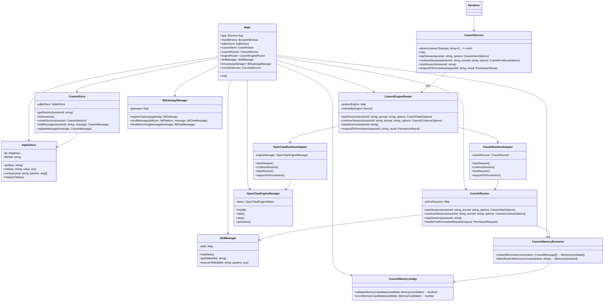

# LobsterAI 技术组件架构分析

## 一、整体架构概述

LobsterAI 是一个基于 Electron + React 的桌面 AI 助手应用，采用严格的进程隔离和分层架构设计，主要分为三大层级：**渲染层（前端UI）**、**IPC通信层**、**主进程层（后端核心）**。整体采用模块化设计，各组件职责清晰，通过事件驱动和依赖注入实现松耦合。

## 二、核心组件及职责

### 1. 主进程核心组件

| 组件                  | 职责                                           | 核心文件                                                                                                                                                                                              |
| ------------------- | -------------------------------------------- | ------------------------------------------------------------------------------------------------------------------------------------------------------------------------------------------------- |
| **主进程入口**           | 应用生命周期管理、窗口管理、IPC路由、核心服务初始化                  | [main.ts](file:///d:/prj/LobsterAI_analysis/src/main/main.ts)                                                                                                                                     |
| **SQLite 存储引擎**     | 持久化存储（会话、消息、配置、用户记忆、定时任务等）                   | [sqliteStore.ts](file:///d:/prj/LobsterAI_analysis/src/main/sqliteStore.ts)                                                                                                                       |
| **协作会话存储**          | 协作会话和消息的CRUD操作                               | [coworkStore.ts](file:///d:/prj/LobsterAI_analysis/src/main/coworkStore.ts)                                                                                                                       |
| **协作运行引擎**          | Claude Agent SDK 执行核心，管理会话生命周期、工具调用权限、流式响应   | [coworkRunner.ts](file:///d:/prj/LobsterAI_analysis/src/main/libs/coworkRunner.ts)                                                                                                                |
| **Agent 引擎路由器**     | 统一调度不同的AI引擎（内置Claude引擎/OpenClaw引擎），对上层屏蔽引擎差异 | [coworkEngineRouter.ts](file:///d:/prj/LobsterAI_analysis/src/main/libs/agentEngine/coworkEngineRouter.ts)                                                                                        |
| **Claude 运行时适配器**   | 内置 Claude Agent SDK 适配器，实现引擎通用接口             | [claudeRuntimeAdapter.ts](file:///d:/prj/LobsterAI_analysis/src/main/libs/agentEngine/claudeRuntimeAdapter.ts)                                                                                    |
| **OpenClaw 运行时适配器** | OpenClaw 引擎网关适配器，对接外部OpenClaw运行时             | [openclawRuntimeAdapter.ts](file:///d:/prj/LobsterAI_analysis/src/main/libs/agentEngine/openclawRuntimeAdapter.ts)                                                                                |
| **OpenClaw 引擎管理器**  | 管理OpenClaw运行时的生命周期（安装、启动、状态监控）               | [openclawEngineManager.ts](file:///d:/prj/LobsterAI_analysis/src/main/libs/openclawEngineManager.ts)                                                                                              |
| **技能管理器**           | 加载、管理自定义技能（PDF/Excel/Word/游戏开发等各类技能）         | [skillManager.ts](file:///d:/prj/LobsterAI_analysis/src/main/skillManager.ts)                                                                                                                     |
| **IM 网关管理器**        | 多IM平台接入（钉钉、飞书、Telegram、Discord、QQ、企业微信等）     | [imGatewayManager.ts](file:///d:/prj/LobsterAI_analysis/src/main/im/imGatewayManager.ts)                                                                                                          |
| **用户内存系统**          | 自动从对话中提取和管理用户记忆，支持显式/隐式记忆提取                  | [coworkMemoryExtractor.ts](file:///d:/prj/LobsterAI_analysis/src/main/libs/coworkMemoryExtractor.ts)、[coworkMemoryJudge.ts](file:///d:/prj/LobsterAI_analysis/src/main/libs/coworkMemoryJudge.ts) |
| **定时任务服务**          | 执行基于Cron表达式的定时任务                             | [cronJobService.ts](file:///d:/prj/LobsterAI_analysis/src/main/libs/cronJobService.ts)                                                                                                            |
| **MCP 服务管理器**       | 管理模型上下文协议(MCP)服务，支持扩展工具能力                    | [mcpServerManager.ts](file:///d:/prj/LobsterAI_analysis/src/main/libs/mcpServerManager.ts)                                                                                                        |
| **日志服务**            | 主进程日志管理，支持日志轮转和导出                            | [logger.ts](file:///d:/prj/LobsterAI_analysis/src/main/logger.ts)                                                                                                                                 |

### 2. 渲染进程核心组件

| 组件             | 职责                                     | 核心文件                                                                                                    |
| -------------- | -------------------------------------- | ------------------------------------------------------------------------------------------------------- |
| **应用入口**       | 应用初始化、路由管理、全局状态初始化                     | [App.tsx](file:///d:/prj/LobsterAI_analysis/src/renderer/App.tsx)                                       |
| **Redux 状态管理** | 全局状态管理（会话、消息、配置、模型、认证等）                | [store/](file:///d:/prj/LobsterAI_analysis/src/renderer/store/)                                         |
| **协作服务**       | 封装主进程IPC调用，管理协作会话生命周期和流式事件             | [services/cowork.ts](file:///d:/prj/LobsterAI_analysis/src/renderer/services/cowork.ts)                 |
| **API 服务**     | 封装LLM API调用，支持SSE流式响应                  | [services/api.ts](file:///d:/prj/LobsterAI_analysis/src/renderer/services/api.ts)                       |
| **认证服务**       | 登录状态管理、令牌刷新                            | [services/auth.ts](file:///d:/prj/LobsterAI_analysis/src/renderer/services/auth.ts)                     |
| **主题服务**       | 深色/浅色主题切换管理                            | [services/theme.ts](file:///d:/prj/LobsterAI_analysis/src/renderer/services/theme.ts)                   |
| **国际化服务**      | 多语言支持（中/英）                             | [services/i18n.ts](file:///d:/prj/LobsterAI_analysis/src/renderer/services/i18n.ts)                     |
| **协作UI组件**     | 协作会话界面、消息展示、输入框、权限弹窗等                  | [components/cowork/](file:///d:/prj/LobsterAI_analysis/src/renderer/components/cowork/)                 |
| **工件系统**       | 丰富的代码输出预览（HTML/SVG/Mermaid/React/代码高亮） | [components/artifacts/](file:///d:/prj/LobsterAI_analysis/src/renderer/components/artifacts/)           |
| **技能管理UI**     | 技能安装、配置、管理界面                           | [components/skills/](file:///d:/prj/LobsterAI_analysis/src/renderer/components/skills/)                 |
| **定时任务UI**     | 定时任务管理、运行历史查看                          | [components/scheduledTasks/](file:///d:/prj/LobsterAI_analysis/src/renderer/components/scheduledTasks/) |

### 3. 公共组件层

| <br />         | 组件                                      | 职责                                                                                                                                        |
| :------------- | --------------------------------------- | ----------------------------------------------------------------------------------------------------------------------------------------- |
| **Preload 脚本** | 通过contextBridge暴露electron API给渲染进程，保障安全 | [preload.ts](file:///d:/prj/LobsterAI_analysis/src/main/preload.ts)                                                                       |
| **通用类型定义**     | 前后端共享的TypeScript类型定义                    | [src/common/](file:///d:/prj/LobsterAI_analysis/src/common/)、[src/renderer/types/](file:///d:/prj/LobsterAI_analysis/src/renderer/types/) |
| **自定义技能库**     | 各类业务技能实现（文档处理、搜索、开发工具等）                 | [SKILLs/](file:///d:/prj/LobsterAI_analysis/SKILLs/)                                                                                      |

## 三、分层调用关系

```
┌───────────────────────────────────────────────────────────┐
│                    Renderer Process (渲染层)               │
│  ┌──────────┐  ┌──────────┐  ┌──────────┐  ┌──────────┐   │
│  │  UI组件  │  │  状态管理 │  │  服务层  │  │  工具函数 │   │
│  └──────────┘  └──────────┘  └─────┬────┘  └──────────┘   │
└────────────────────────────────────┼───────────────────────┘
                                     │ IPC 调用
┌────────────────────────────────────▼───────────────────────┐
│                     Main Process (主进程层)                 │
│  ┌──────────┐  ┌──────────┐  ┌──────────┐  ┌──────────┐   │
│  │ IPC 路由 │  │ 引擎调度  │  │ 业务逻辑  │  │ 存储层    │   │
│  └─────┬────┘  └─────┬────┘  └─────┬────┘  └─────┬────┘   │
│        │              │              │              │        │
│  ┌─────▼──────────────▼──────────────▼──────────────▼────┐   │
│  │                  核心子系统层                          │   │
│  │  ┌─────────┐┌─────────┐┌─────────┐┌─────────┐┌───────┐│   │
│  │  │ Agent 引擎││ 技能系统 ││ IM网关  ││ 内存系统 ││ 定时任务││   │
│  │  └─────────┘└─────────┘└─────────┘└─────────┘└───────┘│   │
│  └───────────────────────────────────────────────────────┘   │
│        │              │              │              │        │
└────────┼──────────────┼──────────────┼──────────────┼────────┘
         ▼              ▼              ▼              ▼
┌───────────────────────────────────────────────────────────┐
│                     外部依赖层                             │
│  Claude SDK / OpenClaw / LLM API / 系统调用 / 第三方服务    │
└───────────────────────────────────────────────────────────┘
```

### 数据流说明

1. **用户交互流**：用户在UI输入prompt → 渲染层服务层通过IPC发送到主进程 → 主进程路由到对应Agent引擎 → 引擎调用LLM和工具 → 结果通过IPC流式返回渲染层 → UI实时更新
2. **权限请求流**：Agent需要调用工具 → 主进程发送权限请求到渲染层 → UI展示权限弹窗 → 用户确认/拒绝 → 结果返回主进程 → 引擎继续执行
3. **持久化流**：会话/消息/配置变更 → 主进程存储层写入SQLite数据库 → 渲染层状态同步更新
4. **记忆提取流**：对话内容 → 内存提取器识别记忆候选 → 内存评判器打分验证 → 写入用户记忆库 → 后续会话自动加载上下文

## 四、主要类实体关系

### 核心类图（Mermaid表示）



## 五、架构设计亮点

1. **引擎无关设计**：通过CoworkEngineRouter统一封装不同AI引擎，上层无需关心底层实现，可无缝切换内置Claude引擎和OpenClaw引擎
2. **严格的安全隔离**：渲染进程与主进程完全隔离，仅通过预定义IPC通道通信，contextIsolation和sandbox完全开启
3. **事件驱动架构**：核心组件基于EventEmitter实现，松耦合且易于扩展
4. **模块化设计**：各业务领域完全独立封装，便于后续功能扩展和维护
5. **统一的流式响应**：所有AI响应都通过统一的流式事件框架处理，保证UI体验一致性
6. **可扩展的技能系统**：基于目录结构的技能自动加载机制，新增技能无需修改核心代码

