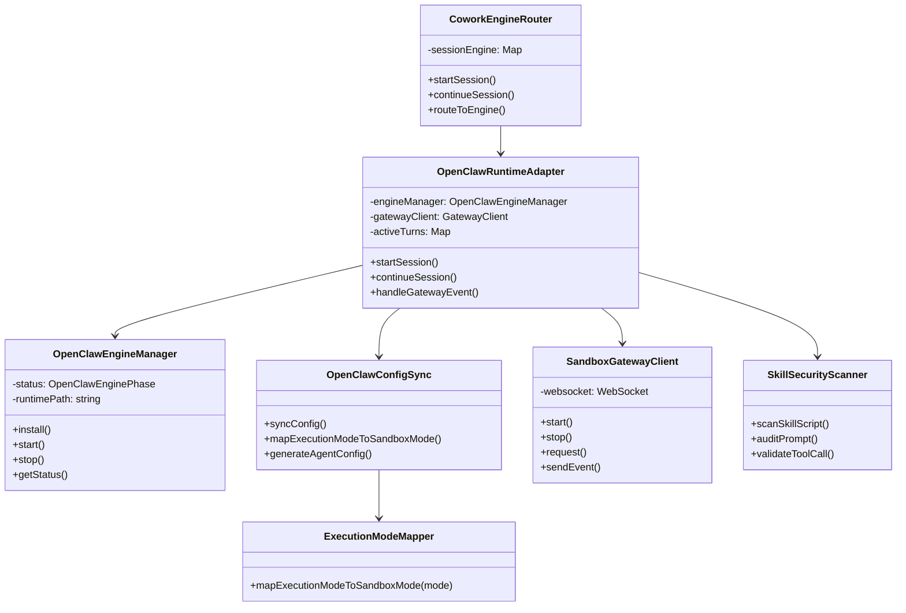
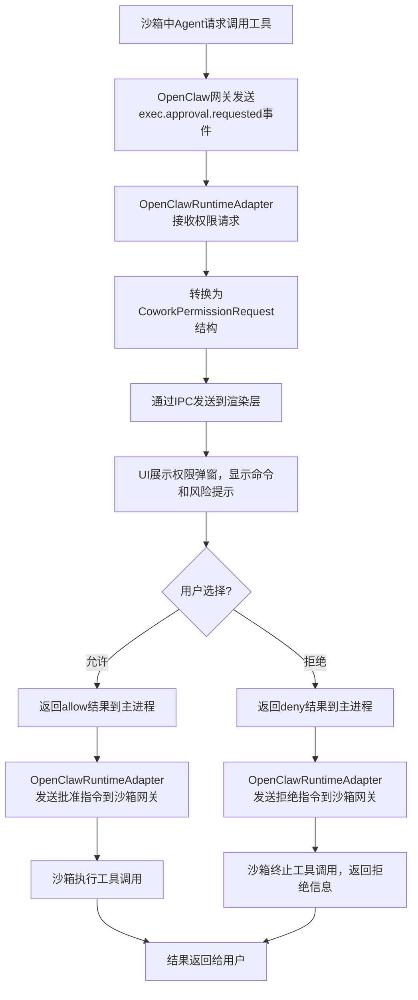
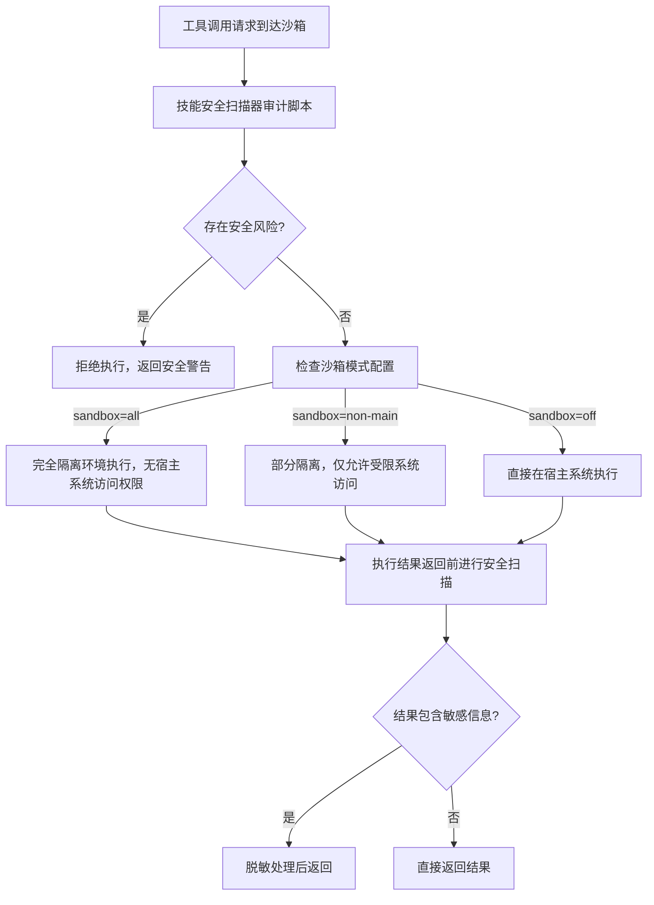

# LobsterAI 沙箱系统架构分析

## 一、沙箱系统概述

LobsterAI 的沙箱系统是基于 OpenClaw 引擎实现的安全执行环境，用于隔离执行不受信任的代码和工具调用，防止恶意操作对宿主系统造成损害。系统支持三种执行模式：`auto`（自动选择）、`local`（本地直接执行）、`sandbox`（完全沙箱隔离）。

## 二、核心组件架构

### 1. 组件架构图



### 2. 核心组件职责

| 组件                         | 职责                                               | 核心文件                                                                                                               |
| -------------------------- | ------------------------------------------------ | ------------------------------------------------------------------------------------------------------------------ |
| **CoworkEngineRouter**     | 引擎路由层，根据配置自动选择使用内置引擎还是OpenClaw沙箱引擎               | [coworkEngineRouter.ts](file:///d:/prj/LobsterAI_analysis/src/main/libs/agentEngine/coworkEngineRouter.ts)         |
| **OpenClawRuntimeAdapter** | OpenClaw运行时适配器，实现CoworkRuntime通用接口，与OpenClaw网关通信 | [openclawRuntimeAdapter.ts](file:///d:/prj/LobsterAI_analysis/src/main/libs/agentEngine/openclawRuntimeAdapter.ts) |
| **OpenClawEngineManager**  | OpenClaw运行时生命周期管理，负责安装、启动、停止、状态监控                | [openclawEngineManager.ts](file:///d:/prj/LobsterAI_analysis/src/main/libs/openclawEngineManager.ts)               |
| **OpenClawConfigSync**     | 配置同步器，将LobsterAI配置转换为OpenClaw可识别的配置格式，包括沙箱模式映射   | [openclawConfigSync.ts](file:///d:/prj/LobsterAI_analysis/src/main/libs/openclawConfigSync.ts)                     |
| **SandboxGatewayClient**   | 沙箱网关客户端，通过WebSocket与OpenClaw网关通信，发送请求和接收事件       | OpenClaw运行时内置                                                                                                      |
| **SkillSecurityScanner**   | 技能安全扫描器，对技能脚本和工具调用进行安全审计，防止恶意操作                  | [skillSecurityScanner.ts](file:///d:/prj/LobsterAI_analysis/src/main/libs/skillSecurity/skillSecurityScanner.ts)   |

## 三、通信方式与协议

### 1. 通信方式

- **进程间通信 (IPC)**：渲染进程与主进程之间通过Electron IPC通道通信，使用预定义的事件类型
- **WebSocket 通信**：主进程与OpenClaw沙箱网关之间通过WebSocket进行双向通信
- **文件系统同步**：配置文件、记忆文件、会话数据通过文件系统在主进程和沙箱之间同步

### 2. IPC 通信协议（渲染层 <-> 主进程）

```typescript
// IPC 事件类型
type CoworkStreamEventType =
  | 'message'           // 新消息
  | 'messageUpdate'     // 消息流式更新
  | 'permissionRequest' // 权限请求
  | 'complete'          // 会话完成
  | 'error';            // 错误事件

// 权限请求结构
interface CoworkPermissionRequest {
  sessionId: string;
  toolName: string;
  toolInput: Record<string, unknown>;
  requestId: string;
  toolUseId?: string | null;
}

// 权限响应结构
interface CoworkPermissionResponse {
  requestId: string;
  result: {
    behavior: 'allow' | 'deny';
    message?: string;
    updatedInput?: Record<string, unknown>;
  };
}
```

### 3. 网关通信协议（主进程 <-> OpenClaw沙箱）

```typescript
// 网关事件帧结构
type GatewayEventFrame = {
  event: string;
  seq?: number;
  payload?: unknown;
};

// 核心事件类型
const GATEWAY_EVENTS = {
  'chat.event': '聊天事件（流式响应）',
  'agent.event': 'Agent事件（工具调用、状态变更）',
  'exec.approval.requested': '执行权限请求',
  'exec.approval.resolved': '执行权限已处理',
  'session.created': '会话创建成功',
  'session.error': '会话错误'
};

// 执行权限请求 payload
type ExecApprovalRequestedPayload = {
  id?: string;
  request?: {
    command?: string;
    cwd?: string | null;
    host?: string | null;
    security?: string | null;
    ask?: string | null;
    resolvedPath?: string | null;
    sessionKey?: string | null;
    agentId?: string | null;
  };
};
```

## 四、执行模式与沙箱级别

LobsterAI定义了三种执行模式，对应不同的沙箱隔离级别：

| 执行模式      | 沙箱模式       | 说明                    | 适用场景               |
| --------- | ---------- | --------------------- | ------------------ |
| `local`   | `off`      | 完全关闭沙箱，工具和命令直接在宿主系统执行 | 信任的工作环境，需要完整系统访问权限 |
| `auto`    | `non-main` | 部分沙箱隔离，非核心工具在沙箱中执行    | 默认模式，平衡安全和便利性      |
| `sandbox` | `all`      | 完全沙箱隔离，所有工具和命令都在沙箱中执行 | 不可信环境，执行未知来源代码     |

**模式映射代码片段**（来自 [openclawConfigSync.ts](file:///d:/prj/LobsterAI_analysis/src/main/libs/openclawConfigSync.ts#L27-L31)）：

```typescript
const mapExecutionModeToSandboxMode = (_mode: CoworkExecutionMode): 'off' | 'non-main' | 'all' => {
  // Sandbox mode disabled — always run locally
  return 'off'; // 当前版本默认关闭沙箱，可根据配置动态返回
};
```

## 五、关键场景流程分析

### 1. 沙箱会话启动流程

```mermaid
flowchart TD
    A[用户选择沙箱模式并发送prompt] --> B[渲染层调用coworkService.startSession()]
    B --> C[IPC发送到主进程CoworkEngineRouter]
    C --> D[路由到OpenClawRuntimeAdapter]
    D --> E{OpenClaw引擎是否运行?}
    E -->|否| F[OpenClawEngineManager启动沙箱 runtime]
    F --> G[OpenClawConfigSync同步配置到沙箱]
    E -->|是| G
    G --> H[创建沙箱会话，设置sandbox.mode]
    H --> I[发送prompt到沙箱网关]
    I --> J[沙箱执行AI推理和工具调用]
    J --> K[流式返回结果到主进程]
    K --> L[主进程通过IPC返回渲染层]
    L --> M[UI实时更新展示]
```

**关键代码位置**：

- [openclawRuntimeAdapter.ts startSession()](file:///d:/prj/LobsterAI_analysis/src/main/libs/agentEngine/openclawRuntimeAdapter.ts#L450)
- [openclawEngineManager.ts start()](file:///d:/prj/LobsterAI_analysis/src/main/libs/openclawEngineManager.ts#L200)
- [openclawConfigSync.ts syncConfig()](file:///d:/prj/LobsterAI_analysis/src/main/libs/openclawConfigSync.ts#L200)

### 2. 工具调用权限审批流程



**关键代码位置**：

- [openclawRuntimeAdapter.ts handleExecApprovalRequested()](file:///d:/prj/LobsterAI_analysis/src/main/libs/agentEngine/openclawRuntimeAdapter.ts#L800)
- [coworkService.ts 权限请求处理](file:///d:/prj/LobsterAI_analysis/src/renderer/services/cowork.ts#L200)
- [CoworkPermissionModal.tsx 权限弹窗UI](file:///d:/prj/LobsterAI_analysis/src/renderer/components/cowork/CoworkPermissionModal.tsx)

### 3. 沙箱环境安全隔离流程



**关键代码位置**：

- [skillSecurityScanner.ts scanSkillScript()](file:///d:/prj/LobsterAI_analysis/src/main/libs/skillSecurity/skillSecurityScanner.ts#L50)
- [skillSecurityPromptAudit.ts auditPrompt()](file:///d:/prj/LobsterAI_analysis/src/main/libs/skillSecurity/skillSecurityPromptAudit.ts#L30)

## 六、沙箱安全特性

1. **多层安全审计**：技能脚本审计、工具调用审计、内容输出审计三层安全检查
2. **细粒度权限控制**：支持按工具类型、命令范围、文件访问路径设置权限
3. **无状态隔离**：每次沙箱会话都是独立环境，会话结束后自动销毁所有状态
4. **资源限制**：可配置CPU、内存、执行时间限制，防止资源耗尽攻击
5. **网络隔离**：沙箱网络访问可配置，支持完全断网、白名单域名访问等模式

## 七、当前版本说明

当前版本（2026.3.x）沙箱模式默认关闭（`mapExecutionModeToSandboxMode` 固定返回 `'off'`），所有命令都直接在本地执行。沙箱功能已完成框架设计，后续版本将逐步开放完整的隔离能力。
